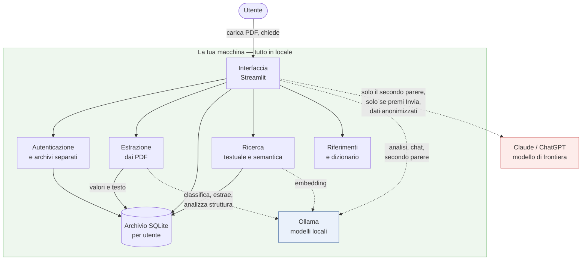

# AHIA

**Archivio e lettura dei referti medici, interamente in locale.**

AHIA prende i PDF dei tuoi referti, ne estrae i valori, li mette in serie
storica e ti lascia ragionarci sopra con un modello linguistico che gira sulla
tua macchina. Nessun dato lascia il computer: niente servizi esterni, niente
account, niente telemetria.

Nasce come banco di prova per capire cosa un LLM locale sappia realmente fare
su documenti sanitari. È scritto per referti italiani: virgola decimale,
prefissi di matrice (`S-`, `P-`, `U-`), diciture che cambiano da laboratorio a
laboratorio, elettroforesi proteica.

La versione corrente è indicata nella barra laterale e in `config.py`
(`VERSIONE`); le modifiche di ciascun rilascio sono in `CHANGELOG.md`.

---

## Cosa fa

**Archivia i referti.** Carichi i PDF — nativi o scansionati — e l'app
riconosce di che documento si tratta: analisi del sangue, urine, ecografia,
radiografia, TAC, visita specialistica, ricovero. Dai referti con valori
numerici estrae gli analiti; da quelli descrittivi conserva il testo e una
sintesi con le conclusioni.

**Normalizza le diciture.** Ogni laboratorio scrive gli esami a modo suo:
`Glicemia`, `S-Glucosio`, `GLUCOSIO SIERICO` sono lo stesso esame. Un dizionario
li riconduce a un nome unico, altrimenti le serie storiche si spezzano. Le
diciture nuove si mappano a mano, con proposte suggerite dal modello che
confermi tu.

**Mostra gli andamenti.** Grafici temporali con l'intervallo di riferimento in
trasparenza, i punti colorati per stato, un confronto normalizzato che mette
sullo stesso asse esami con unità diverse, e una tabella di variazioni
esportabile.

**Legge i referti con un LLM locale.** Analisi complessiva o su un singolo
referto, e una chat che risponde sui tuoi dati. I calcoli non li fa il modello:
differenze, percentuali e conteggi arrivano già pronti, oppure il modello li
chiede a funzioni che interrogano l'archivio.

**Cerca nell'archivio.** Ricerca esatta e ricerca per significato, perché in
italiano medico cercare "fegato grasso" deve trovare "steatosi epatica".

**Prepara un secondo parere anonimizzato.** Un modello locale da 14 miliardi di
parametri non regge il confronto con uno di frontiera sul ragionamento clinico.
L'app compone un quesito da sottoporre a un modello esterno passando il minimo:
niente nome, niente laboratorio, date sostituite da intervalli relativi, età
ridotta a fascia. Il testo lo leggi, lo modifichi e lo copi tu — non parte
nulla in automatico.

**Gestisce più persone.** Ogni utente ha credenziali proprie e un archivio
fisicamente separato. Nemmeno l'amministratore accede ai dati altrui.

---

## Cosa non fa

Vale la pena essere espliciti, perché è la parte che di solito manca.

**Non è un dispositivo medico.** Non è certificato né validato clinicamente.
Non fornisce diagnosi, prognosi o indicazioni terapeutiche, e nessuna sua
risposta va intesa come parere sanitario.

**Non sostituisce il medico e non deve ritardarne il consulto.** Interpretare
un esame richiede la storia clinica, il motivo della prescrizione, le terapie
in corso e l'esame obiettivo: cose che l'app non ha.

**Non garantisce che l'estrazione sia corretta.** Un modello può spostare una
virgola decimale o attribuire a una riga l'intervallo di riferimento di
un'altra. I valori estratti vanno confrontati con il referto originale, almeno
la prima volta per ogni laboratorio nuovo.

**Non sincronizza niente.** Nessun cloud, nessun backup automatico. La cartella
dei dati è tua da copiare.

**Non è un gestionale sanitario.** Non dialoga con il Fascicolo Sanitario
Elettronico, non importa da provider FHIR, non gestisce prescrizioni o
appuntamenti.

---

## ⚠️ Nessuna garanzia, nessuna responsabilità

> **AHIA è fornita "così com'è", senza garanzie di alcun tipo.**
>
> L'applicazione è progettata perché **nulla lasci il tuo computer** senza un
> tuo gesto esplicito, e perché il quesito del secondo parere sia anonimizzato
> prima di qualunque invio. **Questo comportamento non è garantito a priori.**
> Un bug dell'applicazione, di una libreria di terze parti, del motore di
> inferenza o di un servizio esterno, un errore di anonimizzazione, o un uso
> improprio possono far sì che dati personali — compresi dati sanitari — escano
> dal computer o vengano condivisi con terze parti.
>
> Chi ha realizzato AHIA **non si assume alcuna responsabilità** per dati
> personali condivisi con terze parti, per malfunzionamenti o bug propri o di
> componenti di terze parti, per errori dell'applicazione, né per un utilizzo
> errato o improprio. L'utilizzo avviene **a rischio esclusivo** di chi usa
> l'applicazione. Rileggi sempre ciò che stai per inviare.
>
> **L'integrazione con i modelli di frontiera tramite chiave API (Claude,
> ChatGPT) non è testata** contro i servizi reali: è implementata ma non
> verificata, potrebbe non funzionare o comportarsi in modo inatteso. Il
> percorso collaudato è quello manuale — copi il testo e lo incolli tu.

---

## Cosa serve

L'app si appoggia a [Ollama](https://ollama.com) per eseguire i modelli in
locale, e funziona su macOS, Linux e Windows. Serve inoltre Python 3.10 o
successivo; tutte le dipendenze hanno wheel precompilate per i tre sistemi,
quindi l'installazione non compila nulla.

### Modelli

| Modello | A cosa serve | Peso |
|---|---|---|
| `qwen3:14b` | estrazione dai PDF nativi, analisi, chat | ~9 GB |
| `qwen2.5vl:7b` | lettura delle scansioni (multimodale) | ~6 GB |
| `bge-m3` | ricerca per significato, facoltativa | ~1,2 GB |
| `qwen3:32b` | analisi più accurata, se la macchina lo regge | ~19 GB |

Tutti sono selezionabili singolarmente: si può usare un modello diverso per
ogni funzione, ed è sensato farlo — l'estrazione deve solo trascrivere una
tabella, l'analisi deve ragionare.

### Hardware

Il fattore che conta è la memoria disponibile per il modello: se ci sta
interamente, la velocità è accettabile; se deve essere ripartito sulla CPU,
crolla.

| | Memoria | Cosa aspettarsi |
|---|---|---|
| **Minimo** | 16 GB di RAM, solo CPU | Funziona, ma l'estrazione di un referto richiede diversi minuti e la chat è impraticabile. Utile per provare l'app, non per usarla. |
| **Consigliato** | 12 GB di VRAM (es. RTX 3060) oppure 16 GB di memoria unificata su Apple Silicon | I modelli consigliati stanno interamente in memoria: 20-30 token al secondo, estrazione di un referto in 30-60 secondi. |
| **Comodo** | 24 GB di VRAM o 32 GB di memoria unificata | Permette il modello da 32 miliardi di parametri per l'analisi, tenendo quello più piccolo e veloce per estrazione e chat. |

**Spazio su disco**: circa 16 GB per i modelli, più pochi megabyte per
l'archivio — un database con anni di referti resta sotto i 50 MB, i PDF
originali a parte.

Su GPU NVIDIA i modelli girano in CUDA senza configurazione; su Apple Silicon
in Metal, con una resa più bassa nella lettura delle scansioni.

---

## Installazione

### 1. Installa Ollama

AHIA usa [Ollama](https://ollama.com) per eseguire i modelli in locale. Va
installato per primo.

**macOS** — scarica l'app da [ollama.com/download](https://ollama.com/download),
aprila e trascinala nelle Applicazioni. Al primo avvio si installa da sé e resta
attiva nella barra dei menu. In alternativa, con [Homebrew](https://brew.sh):

```bash
brew install ollama
```

**Windows** — scarica l'installer da
[ollama.com/download](https://ollama.com/download) ed eseguilo. Ollama parte
automaticamente e resta nell'area di notifica.

**Linux** — un comando solo:

```bash
curl -fsSL https://ollama.com/install.sh | sh
```

Per verificare che Ollama sia attivo, apri un terminale e digita `ollama list`:
se risponde (anche con una lista vuota), è pronto. Ollama espone un servizio
locale su `http://localhost:11434`; AHIA vi si collega da sé.

> Su Windows e macOS l'app di Ollama va lasciata in esecuzione mentre usi AHIA.
> Su Linux, se non parte da solo, avvialo con `ollama serve`.

### 2. Scarica i modelli

Una volta sola, dal terminale:

```bash
ollama pull qwen3:14b && ollama pull qwen2.5vl:7b
```

Facoltativo, per la ricerca semantica:

```bash
ollama pull bge-m3
```

Puoi anche non scaricarli ora: se apri AHIA e un modello selezionato non è
installato, l'app te lo segnala con il comando esatto per scaricarlo.

### 3. Avvia AHIA

Scompatta l'archivio, entra nella cartella e lancia lo script, che crea il
virtualenv, installa le dipendenze Python e avvia l'app.

**macOS e Linux**

```bash
cd ahia && ./avvia.sh
```

**Windows** — doppio clic su `avvia.bat`, oppure da prompt:

```bat
cd ahia && avvia.bat
```

A mano, se preferisci:

```bash
cd ahia && python3 -m venv .venv && source .venv/bin/activate && pip install -r requirements.txt && streamlit run app.py
```

```bat
cd ahia && python -m venv .venv && .venv\Scripts\activate && pip install -r requirements.txt && streamlit run app.py
```

L'app risponde su `http://localhost:8501`.

---

## Come funziona

### Architettura



Le frecce continue sono dati che restano sul disco; quelle tratteggiate sono
chiamate ai modelli. L'unica freccia che esce dalla macchina è il secondo
parere, e solo quando lo invii tu, con i dati già anonimizzati.

### Principi

L'idea di fondo è usare lo strumento giusto per ogni tipo di dato.

**I numeri stanno in un database relazionale.** Le domande che si fanno a una
serie di valori sono ordinamenti, confronti e differenze: un database le esegue
in modo esatto e completo. Una ricerca vettoriale restituirebbe i risultati più
simili senza garantire di averli trovati tutti — su una serie storica è
esattamente il difetto da evitare.

**Il testo passa dalla ricerca.** Per i referti descrittivi servono ricerca
testuale e similarità semantica, ed è lì che gli embedding hanno senso.

**L'LLM sceglie le domande, non fa i conti.** Il contesto contiene numeri già
calcolati, e le funzioni che il modello può invocare eseguono interrogazioni
predefinite, con i nomi degli esami validati contro l'archivio.

### Schede di layout: il primo referto di un laboratorio è più lento

Ogni laboratorio impagina i referti a modo suo. La prima volta che ne incontra
uno mai visto, l'app ne studia la struttura e ne ricava una **scheda di
lettura** — dove stanno i valori, gli intervalli, cosa ignorare — che i referti
successivi dello stesso laboratorio riusano.

Questo ha un costo, ed è bene conoscerlo: **sul primo referto di ogni
laboratorio nuovo l'estrazione viene eseguita due volte** — una per estrarre e
capire di che laboratorio si tratta, una per applicare la scheda appena creata e
verificare se migliora il risultato. Su una macchina lenta il primo referto può
quindi richiedere diversi minuti. È voluto: il costo si paga **una sola volta
per laboratorio**, e tutti i referti successivi di quello stesso laboratorio
partono già con la scheda pronta, in una sola estrazione.

Se la scheda non migliora l'estrazione iniziale, viene comunque conservata per i
prossimi referti, e si tiene il risultato della prima estrazione. L'analisi
preventiva della struttura si può disattivare dalla scheda *Referti*
(`ANALISI_STRUTTURA_AUTO` in `config.py`): senza, ogni referto viene estratto una
volta sola, ma non si beneficia delle schede di layout.

### I moduli

| File | Ruolo |
|---|---|
| `app.py` | interfaccia Streamlit, tutte le schede |
| `core.py` | SQLite, profilo, impostazioni, contesto per l'LLM, client Ollama |
| `ingest.py` | lettura PDF, estrazione, diagnosi e recupero delle estrazioni |
| `grafici.py` | serie storiche e grafici Altair |
| `semantica.py` | ricerca per significato con embedding |
| `strumenti.py` | funzioni che il modello può invocare sull'archivio |
| `parere.py` | quesito anonimizzato per il secondo parere |
| `riferimenti.py` | intervalli di riferimento e collegamenti alle schede |
| `utenti.py` | autenticazione, archivi separati, export/import |
| `segreti.py` | chiavi API cifrate, invio ai modelli di frontiera |
| `config.py` | percorsi, funzioni LLM, conversioni di unità, dizionario di base |
| `avvia.sh` | crea il venv, installa, avvia |

---

## Dove finiscono i dati

Tutto in `~/.ahia` — su Windows `C:\Users\<utente>\.ahia` — modificabile con
la variabile d'ambiente `AHIA_DATA_DIR`. Ogni utente ha un archivio fisicamente
separato sotto `~/.ahia/archivi/<id>/`:

| File | Contenuto |
|---|---|
| `salute.db` | SQLite: profilo, risultati, conversazioni |
| `referti/` | copia dei PDF caricati |
| `alias_analiti.json` | dizionario personale delle diciture |

Per il backup basta copiare la cartella, oppure usare l'esportazione in zip
dalla barra laterale. Se la macchina è condivisa, valuta un filesystem cifrato:
il database non è protetto da password.

---

## Privacy e sicurezza

L'accesso richiede un'utenza. Al primo avvio viene chiesto di creare
l'amministratore; in alternativa si possono usare le variabili d'ambiente
`AHIA_ADMIN_USER` e `AHIA_ADMIN_PASSWORD` per un'installazione automatizzata.

Le password sono conservate come impronta scrypt con sale casuale per utente,
mai in chiaro. Cinque tentativi falliti sospendono l'accesso per quindici
minuti. La sessione vive nella scheda del browser: chiudendola o ricaricando la
pagina si torna alla schermata di accesso — comportamento voluto, perché
l'accesso non lasci traccia sul dispositivo.

**Ogni utente vede solo i propri dati.** Non per via di un filtro nelle query,
ma perché ogni utente ha un database e una cartella di referti propri. Un errore
in una query non può far trapelare i dati di un altro: sono file diversi. Questo
vale anche per l'amministratore, che gestisce le utenze ma non accede ai loro
archivi.

L'app ascolta solo su `localhost` (`.streamlit/config.toml`). Esporla in rete
richiede almeno HTTPS davanti: il login viaggerebbe altrimenti in chiaro.

Il database non è cifrato. Chiunque abbia accesso all'utente del sistema legge
l'archivio: se la macchina è condivisa, usa un filesystem cifrato e punta
`AHIA_DATA_DIR` lì. Le chiavi API del secondo parere fanno eccezione: sono
cifrate con una chiave derivata dalla password dell'utente.

I PDF sono dati non fidati. Il testo estratto finisce nel database, nei grafici
e nel prompt del modello, quindi:

- i nomi dei file vengono sanificati prima di essere scritti su disco;
- tutte le query usano parametri, mai concatenazione di stringhe;
- l'interfaccia non interpreta HTML proveniente dai dati estratti;
- **un PDF costruito ad arte può però influenzare il modello** con istruzioni
  nascoste nel testo. L'effetto è limitato — il modello non esegue codice e gli
  strumenti accettano solo query predefinite — ma una sintesi può essere
  manipolata. Carica referti che provengono dal tuo laboratorio.

`OLLAMA_HOST` accetta solo `http://` e `https://`, così una variabile
d'ambiente ostile non può far leggere file locali.

---

## Stato del progetto

Software sperimentale, in evoluzione, nato per un uso personale. Funziona ed è
collaudato sui casi che ho incontrato, ma incontrerà sicuramente layout di
referti che non gestisce bene: i formati dei laboratori italiani sono molti e
tutti diversi.

L'estrazione va verificata sul primo referto di ogni laboratorio nuovo: i
layout cambiano e un valore letto male entra nel database senza segnalarlo.

Segnalazioni e contributi sono benvenuti, soprattutto se accompagnati dalla
descrizione del referto che ha creato problemi — non dal referto stesso.

## Ringraziamenti

Le descrizioni degli esami sono collegate a
[labtestsonline.it](https://labtestsonline.it), il portale divulgativo di
SIBioC — Società Italiana di Biochimica Clinica e Biologia Molecolare Clinica.
L'app conserva solo i collegamenti: i contenuti restano sul loro sito.

## Licenza

[GNU Affero General Public License v3.0](LICENSE).

In breve: puoi usare, studiare, modificare e ridistribuire il programma
liberamente, a condizione che le versioni modificate restino sotto la stessa
licenza. La particolarità dell'AGPL rispetto alla GPL è che l'obbligo vale
anche per chi non distribuisce alcun file ma offre il programma come servizio
attraverso una rete: anche in quel caso gli utenti hanno diritto al sorgente.

Per un'app che tratta referti medici mi sembra la scelta giusta: chi affida i
propri dati sanitari a un programma dovrebbe poter vedere cosa quel programma
ne fa.

Il progetto usa PyMuPDF, a sua volta distribuita sotto AGPL-3.0.

---

### In English

AHIA is a fully local medical records tool: it extracts values from lab report
PDFs, tracks them over time, and lets you discuss them with a language model
running on your own machine. Nothing leaves the computer.

It is built specifically for **Italian** lab reports — decimal commas, sample
matrix prefixes, laboratory-specific naming — so its usefulness outside that
context is limited. The interface is in Italian; the usage disclaimer is
available in both Italian and English.

It is experimental software, not a medical device, and does not replace a
physician. It is provided "as is", without warranty of any kind, and the author
accepts no liability for any data shared with third parties, for malfunctions of
the software or third-party components, or for improper use. The frontier-model
API integration (Claude, ChatGPT) is implemented but untested.
