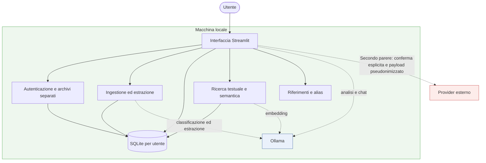
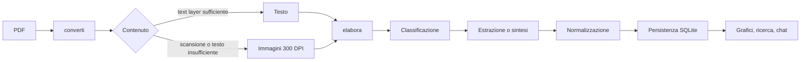
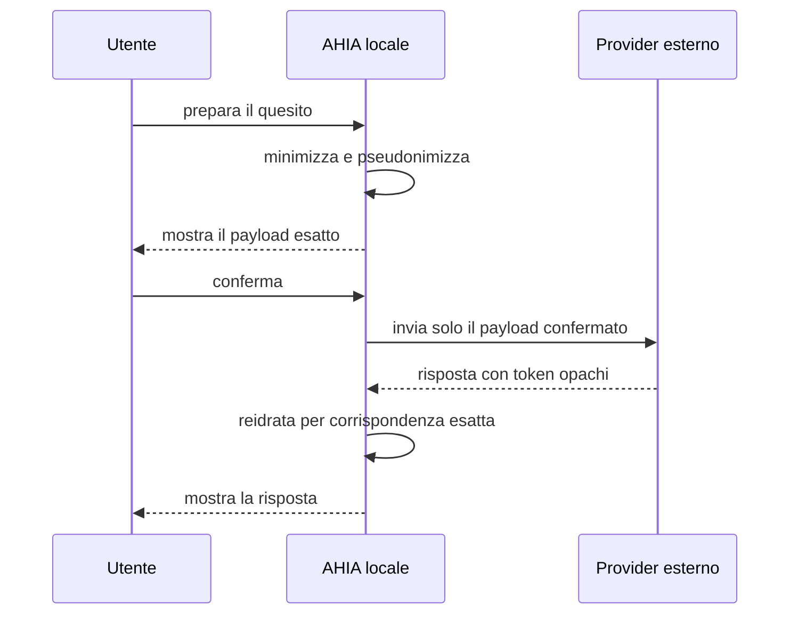

# Architettura di AHIA

Questo documento descrive le fasi di elaborazione, i confini dei componenti e i flussi dei dati di AHIA. Le istruzioni di installazione e uso restano nel [`README`](../README.md); lo stato verificato della release è in [`STATO_PROGETTO.md`](STATO_PROGETTO.md).

## Vista complessiva

Le operazioni ordinarie restano locali. L’unico flusso previsto verso un provider esterno è il Secondo parere, dopo minimizzazione, pseudonimizzazione, revisione e conferma esplicita dell’utente.

## Principi architetturali

**Il PDF è una sorgente, non il formato interno.** Viene aperto durante l’ingestione e conservato per una futura rielaborazione, ma grafici, ricerca e chat lavorano sui dati estratti.

**I numeri sono relazionali.** Ordinamenti, differenze, conversioni e serie storiche sono eseguiti in modo deterministico sul database; non sono delegati alla ricerca vettoriale o al modello.

**Il testo è ricercabile.** Referti descrittivi e frammenti usano ricerca testuale e, quando configurata, similarità semantica tramite embedding locale.

**L’LLM sceglie operazioni, non sostituisce i calcoli.** Le funzioni esposte al modello eseguono query predefinite e validano i nomi degli esami contro l’archivio.

**L’isolamento utente è fisico.** Ogni utente dispone di un database e di una directory di referti separati; l’amministratore gestisce le utenze ma non accede ai loro archivi.

## Pipeline di ingestione

La separazione è esplicita in `ingest.py`:

- `converti()` è l’unico punto che conosce il PDF e restituisce un `Contenuto` testuale o visuale;
- `elabora()` riceve il `Contenuto`, classifica il documento, estrae analiti o produce la sintesi;
- `elabora_documento()` compone i due passaggi per l’interfaccia.

Questa giuntura consente di collaudare l’estrazione senza costruire ogni volta un PDF e permette a un corpus sintetico di alimentare direttamente il livello appropriato. Il contratto con FAKING_MEDDOC è in [`INTEGRAZIONE_FAKING_MEDDOC.md`](INTEGRAZIONE_FAKING_MEDDOC.md).

## Schede di layout

Quando AHIA incontra per la prima volta un laboratorio, analizza il layout e costruisce una scheda di lettura con posizione dei valori, intervalli e contenuti da ignorare. Sul primo referto l’estrazione viene eseguita una seconda volta con la nuova scheda e viene conservato il risultato migliore.

La scheda resta disponibile per i referti successivi dello stesso laboratorio, che normalmente richiedono una sola estrazione. Se la seconda estrazione non migliora il risultato iniziale, la scheda viene conservata ma il primo risultato resta quello effettivo. `ANALISI_STRUTTURA_AUTO` in `config.py` controlla questo comportamento.

## Normalizzazione e persistenza

L’estrazione produce nomi e unità così come compaiono nel referto. `ingest.normalizza()` applica alias, conversioni di unità e intervalli di riferimento prima della persistenza. Le diciture sconosciute restano visibili per una mappatura controllata; le proposte del modello non vengono accettate automaticamente.

I dati applicativi sono sotto `AHIA_DATA_DIR` (per default `~/.ahia`). Ogni archivio utente contiene:

| Risorsa | Ruolo |
|---|---|
| `salute.db` | profilo, risultati, testi e conversazioni |
| `referti/` | copia dei PDF caricati, utile per la rielaborazione |
| `alias_analiti.json` | dizionario personale delle diciture |

Il database non è cifrato dall’applicazione. Su macchine condivise il confine di protezione deve essere fornito dal filesystem o dal volume cifrato.

## Lettura e interrogazione

- `grafici.py` costruisce serie storiche e visualizzazioni dai valori normalizzati;
- `semantica.py` indicizza e ricerca i testi tramite embedding;
- `strumenti.py` espone al modello interrogazioni controllate sull’archivio;
- `core.py` gestisce persistenza, contesto e client Ollama.

Il modello riceve risultati già calcolati quando possibile. L’output resta sperimentale e non è una diagnosi né un parere clinico validato.

## Secondo parere e confine esterno

La mappa dei token resta locale e temporanea. La reidratazione avviene soltanto per token esatti, mai per somiglianza. Presidio e il NER italiano sono un adapter opzionale; i recognizer di base restano disponibili. La specifica completa è in [`PSEUDONIMIZZAZIONE.md`](PSEUDONIMIZZAZIONE.md).

## Componenti principali

| Area | File principali |
|---|---|
| interfaccia e navigazione | `app.py`, `ui_navigazione.py`, `ui_impostazioni.py` |
| configurazione modelli | `ui_modelli_locali.py`, `catalogo_modelli.py`, `configurazione_modelli.py`, `hardware_modelli.py` |
| ingestione | `ingest.py` |
| persistenza e contesto | `core.py` |
| grafici e ricerca | `grafici.py`, `semantica.py`, `strumenti.py` |
| secondo parere | `parere.py`, `secondo_parere_e2e.py`, `pseudonimizzazione.py`, `presidio_ahia.py`, `regole_pii.py` |
| utenti e segreti | `utenti.py`, `segreti.py` |
| riferimenti e configurazione | `riferimenti.py`, `config.py` |
| collaudi sintetici | `benchmark_pii.py`, `benchmark_estrazione.py`, `tests/fixtures/` |

## Confini e limiti

- Un PDF non fidato può contenere istruzioni che influenzano il modello; gli strumenti sono limitati a funzioni predefinite, ma una sintesi può comunque essere manipolata.
- L’estrazione va verificata almeno sul primo referto di ogni nuovo laboratorio.
- I modelli non sono validati clinicamente.
- L’applicazione non cifra il database e non effettua backup o sincronizzazione cloud automatici.
- Provider esterni ricevono dati soltanto nel percorso esplicito del Secondo parere; un errore di riconoscimento PII resta un rischio residuo.
