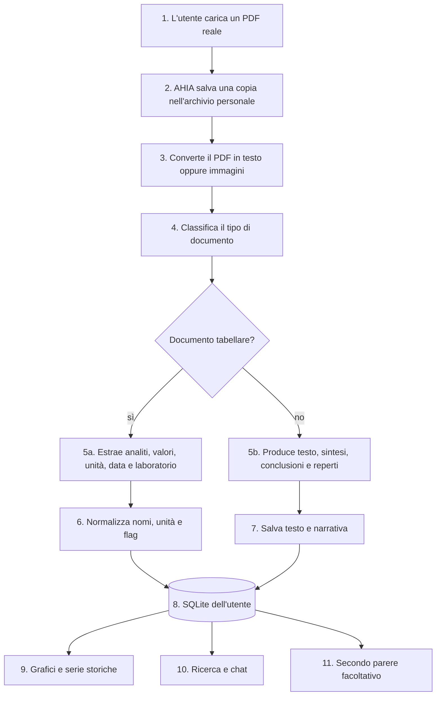
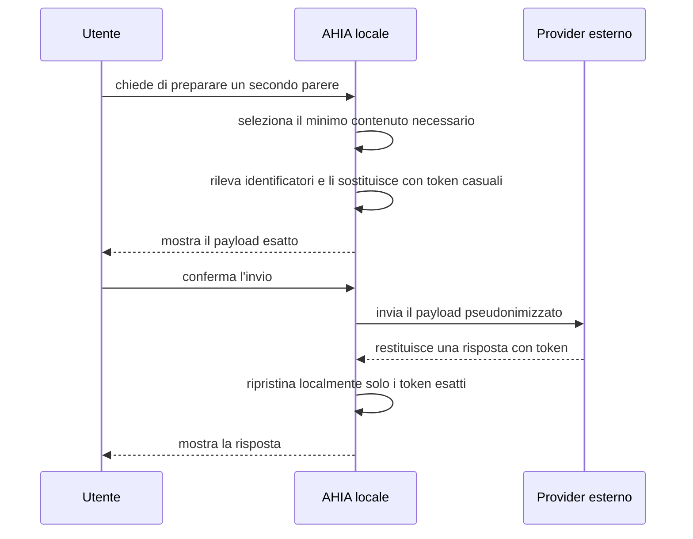

# Architettura di AHIA

## 1. Che cos’è AHIA

AHIA è un archivio personale per referti medici. L’utente carica i propri PDF; AHIA ne estrae informazioni utili, le organizza nel tempo e permette di consultarle con grafici, ricerca e modelli linguistici locali.

Il percorso ordinario rimane sul computer:

- i PDF originali vengono conservati nell’archivio dell’utente;
- i modelli di classificazione, estrazione, sintesi ed embedding girano con Ollama;
- dati strutturati e testi vengono salvati in SQLite;
- non esiste telemetria né sincronizzazione automatica.

L’unica funzione che può contattare un servizio esterno è il **Secondo parere**. L’invio avviene soltanto su richiesta, dopo pseudonimizzazione e conferma del testo esatto.

AHIA è software sperimentale. Non è un dispositivo medico, non produce diagnosi e non garantisce che un valore sia stato letto correttamente.

## 2. Cosa succede quando si carica un referto



### 2.1 Salvataggio del PDF

Il PDF viene copiato nella directory dell’utente. Serve come fonte verificabile e permette di ripetere l’estrazione quando cambiano modello, prompt o regole.

Ogni utente ha file fisicamente separati. L’amministratore gestisce le utenze ma non apre gli archivi personali dall’applicazione.

### 2.2 Conversione: testo o immagini

`ingest.converti()` è l’unico punto del sistema che apre il PDF.

- Se ogni pagina contiene una quantità sufficiente di testo leggibile, AHIA estrae il text layer con `pdfplumber`.
- Se il testo manca o è insufficiente, AHIA rasterizza le pagine a 300 DPI con PyMuPDF e le codifica come immagini.

Il risultato è un oggetto semplice:

```python
Contenuto(testo="...", immagini=[])
```

oppure:

```python
Contenuto(testo=None, immagini=["pagina 1", "pagina 2"])
```

Da questo punto in poi il motore di estrazione non dipende più dal PDF. Questa separazione è anche il punto attraverso cui FAKING_MEDDOC collauda AHIA con testo sintetico.

### 2.3 Classificazione

`ingest.elabora()` usa la prima parte del contenuto per riconoscere il tipo di documento: analisi del sangue, urine, ecografia, radiografia, TAC, visita, ricovero o altro.

Per un PDF nativo usa il modello testuale; per una scansione usa il modello vision. La classificazione restituisce anche data, titolo e struttura o laboratorio quando riconoscibili.

### 2.4 Estrazione

Per i documenti tabellari AHIA estrae:

- dicitura dell’esame così come appare nel referto;
- valore;
- unità;
- intervallo di riferimento, quando presente;
- flag;
- data del prelievo e laboratorio.

Per i documenti narrativi conserva il testo disponibile e chiede al modello una struttura con sintesi, conclusioni e reperti rilevanti.

Le scansioni vengono elaborate pagina per pagina dal modello vision. I PDF nativi vengono passati al modello testuale come un unico contenuto.

### 2.5 Normalizzazione

Laboratori diversi usano nomi e unità differenti per lo stesso esame. `ingest.normalizza()` applica:

1. dizionario degli alias, per esempio `Glicemia`, `S-Glucosio` e `GLUCOSIO SIERICO` → `GLUCOSIO`;
2. conversioni verso l’unità canonica;
3. intervalli di riferimento;
4. flag `L`, `N` o `H`;
5. controllo delle diciture sconosciute.

Le proposte del modello per nuovi alias devono essere confermate. Non diventano regole automaticamente.

### 2.6 Persistenza

I risultati normalizzati, i testi e le conversazioni vengono salvati nel database SQLite dell’utente. Grafici e calcoli leggono il database, non chiedono al modello di ricostruire i numeri ogni volta.

Questo è un principio centrale: il modello estrae e interpreta; il database ordina, confronta, deduplica e calcola.

## 3. Schede di lettura dei laboratori

Ogni laboratorio impagina le tabelle in modo diverso. Quando AHIA incontra una struttura nuova può chiedere al modello di descriverne il layout e salvare una scheda di lettura.

Sul primo referto di un laboratorio nuovo il processo può essere:

1. prima estrazione senza scheda;
2. analisi del layout;
3. seconda estrazione con la nuova scheda;
4. confronto e conservazione del risultato migliore.

I referti successivi dello stesso laboratorio usano subito la scheda e normalmente richiedono una sola estrazione. La funzione può essere disattivata con `ANALISI_STRUTTURA_AUTO`.

## 4. Come vengono usati i dati

### Grafici e serie storiche

`grafici.py` legge i valori normalizzati, li ordina per data e costruisce serie confrontabili. Deduplicazione, differenze e conteggi sono operazioni deterministiche sul database.

### Ricerca

La ricerca esatta usa testo e campi archiviati. `semantica.py` aggiunge ricerca per significato tramite embedding locale, utile per referti narrativi.

### Chat e analisi

Il modello riceve contesto già selezionato. Quando deve interrogare l’archivio usa le funzioni controllate in `strumenti.py`; non può eseguire query arbitrarie né viene incaricato di rifare calcoli già disponibili.

## 5. Secondo parere: l’unico confine esterno



La mappa token-valore resta nella sessione locale. Un token alterato non viene corretto per somiglianza. Regole personali e chiavi API sono cifrate; il database sanitario non lo è.

La descrizione completa dei controlli e del rischio residuo è in [`PSEUDONIMIZZAZIONE.md`](PSEUDONIMIZZAZIONE.md).

## 6. Come FAKING_MEDDOC entra nel progetto

FAKING_MEDDOC non fa parte dell’esecuzione ordinaria di AHIA. Serve a collaudare il passaggio più difficile: l’estrazione di dati clinici da testo.

Il generatore produce:

```text
testo sintetico       → dato in ingresso a ingest.elabora()
truth manifest JSON   → risposta corretta con cui confrontare l'estrazione
```

Il PDF reale usato localmente da FAKING_MEDDOC non arriva mai in AHIA. Il repository contiene soltanto coppie testo/manifest interamente sintetiche.

Il percorso è stato provato end-to-end con output reali di FAKING_MEDDOC 0.2.22. Il corpus e il test sono descritti in [`INTEGRAZIONE_FAKING_MEDDOC.md`](INTEGRAZIONE_FAKING_MEDDOC.md).

## 7. Archivi e isolamento

Per default i dati sono sotto `~/.ahia`; `AHIA_DATA_DIR` permette di scegliere un’altra posizione.

```text
~/.ahia/
└── archivi/
    └── <id utente>/
        ├── salute.db
        ├── referti/
        └── alias_analiti.json
```

| Elemento | Contenuto |
|---|---|
| `salute.db` | profilo, risultati, testi, impostazioni e conversazioni |
| `referti/` | copie dei PDF caricati |
| `alias_analiti.json` | mappature personali delle diciture |

Il database non è cifrato da AHIA. Su una macchina condivisa va usato un filesystem o volume cifrato e va protetto l’account del sistema operativo.

## 8. Componenti principali

| Responsabilità | Moduli |
|---|---|
| interfaccia | `app.py`, `ui_navigazione.py`, `ui_impostazioni.py` |
| conversione ed estrazione | `ingest.py` |
| database e contesto | `core.py` |
| alias e riferimenti | `config.py`, `riferimenti.py` |
| grafici e ricerca | `grafici.py`, `semantica.py` |
| strumenti per il modello | `strumenti.py` |
| configurazione dei modelli | `catalogo_modelli.py`, `configurazione_modelli.py`, `hardware_modelli.py`, `ui_modelli_locali.py` |
| Secondo parere | `parere.py`, `secondo_parere_e2e.py`, `pseudonimizzazione.py`, `presidio_ahia.py`, `regole_pii.py` |
| utenti e segreti | `utenti.py`, `segreti.py` |
| benchmark FAKING_MEDDOC | `benchmark_estrazione.py`, `tools/benchmark_estrazione.py` |

## 9. Cosa è deterministico e cosa no

| Componente | Deterministico? | Conseguenza |
|---|---:|---|
| conversione PDF | sì, a parità di librerie e file | test automatico |
| alias, unità, flag, deduplica, serie | sì | gate CI |
| estrazione e sintesi con LLM | no | benchmark con metriche, non singola asserzione assoluta |
| query e calcoli SQLite | sì | risultati ripetibili |
| Secondo parere esterno | no | revisione umana sempre necessaria |

## 10. Limiti

- Un valore estratto male può entrare nel database: il primo referto di ogni laboratorio va confrontato con il PDF.
- Un PDF può contenere istruzioni capaci di influenzare il modello; gli strumenti disponibili sono limitati, ma una sintesi può comunque essere manipolata.
- I modelli locali ed esterni non sono validati clinicamente.
- Il database non è cifrato e non esiste backup cloud automatico.
- La pseudonimizzazione riduce l’esposizione ma non garantisce anonimizzazione.
- I tre casi FAKING_MEDDOC verificati dimostrano il funzionamento del collegamento, non la qualità generale su tutti i referti italiani.
