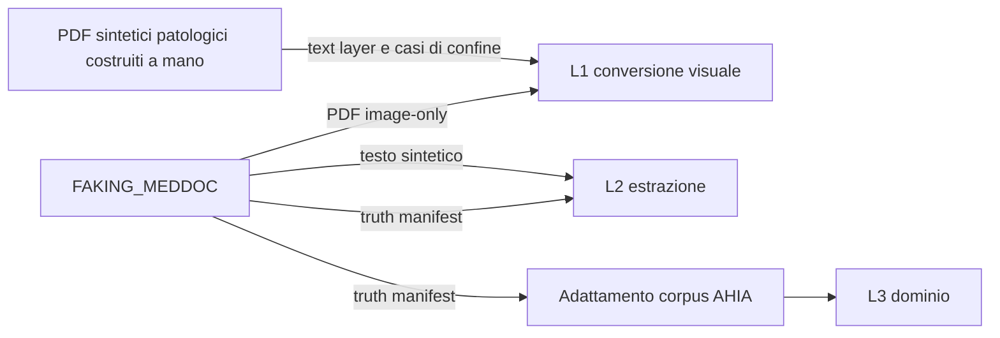

# Integrazione con FAKING_MEDDOC

Questo documento descrive come AHIA usa gli artefatti sintetici prodotti da FAKING_MEDDOC. È la prospettiva del **consumatore**; il formato prodotto e i gate di generazione sono documentati nel repository FAKING_MEDDOC in `docs/INTEGRAZIONE_AHIA.md`.

FAKING_MEDDOC non è una dipendenza runtime di AHIA. Il corpus viene generato, revisionato e promosso offline; AHIA ne conserva una copia congelata e autosufficiente.

## Relazione fra i progetti



Il PDF image-only esercita il ramo scansione/vision. Il ramo con text layer nativo viene collaudato separatamente con PDF sintetici costruiti per quel comportamento.

## Corpus congelato

La fixture canonica è [`tests/fixtures/faking_meddoc_corpus.json`](../tests/fixtures/faking_meddoc_corpus.json). Contiene soltanto referti sintetici e registra per ogni caso:

- identificatore del caso e testo sintetico;
- versione dello schema, versione del generatore e seed;
- data e laboratorio sintetici;
- esami attesi con nome, valore e unità;
- aspettative di dominio AHIA, come range e flag.

Il truth manifest prodotto da FAKING_MEDDOC contiene il nucleo `nome`/`valore`/`unita`. Il corpus AHIA può aggiungere aspettative proprie, per esempio `range_min`, `range_max` e `flag`: questi campi sono parte del contratto di collaudo di AHIA, non del formato sorgente.

La `generator_version` è provenienza storica. Non va aggiornata quando esce una nuova release del produttore, ma soltanto quando il singolo caso viene rigenerato e revisionato.

## Livelli di collaudo

### L1 — Conversione

Verifica la giuntura `ingest.converti()`:

- PDF con text layer sufficiente → `Contenuto` testuale;
- scansione o text layer insufficiente → pagine immagine;
- gestione dei PDF non validi e dei casi limite.

È deterministico e fa parte della suite automatica. Le fixture FAKING_MEDDOC coprono il percorso visuale; i PDF nativi patologici vengono costruiti nei test AHIA.

```bash
.venv/bin/python -m unittest discover -s tests -p 'test_ingest.py'
```

### L2 — Estrazione

Misura l’estrazione del modello locale confrontando la risposta con la verità nota. Le metriche comprendono:

- recall degli analiti;
- accuratezza di valori e unità;
- analiti allucinati.

Poiché dipende dal modello, è un benchmark locale e non un gate deterministico di CI.

```bash
.venv/bin/python tools/benchmark_estrazione.py
```

### L3 — Regole di dominio

Usa direttamente la verità nota, senza modello, per verificare:

- alias di analiti equivalenti;
- conversioni di unità;
- calcolo dei flag rispetto agli intervalli;
- deduplicazione;
- ordinamento e composizione delle serie storiche.

È deterministico e fa parte della suite CI.

```bash
.venv/bin/python -m unittest discover -s tests -p 'test_collaudo_dominio_sintetico.py'
```

## Aggiornamento del corpus

L’aggiornamento è deliberato, non automatico:

1. generare PDF, testo e truth manifest in FAKING_MEDDOC con modalità clinica sintetica;
2. completare i gate di sicurezza e la review umana nel progetto produttore;
3. verificare che gli artefatti non contengano contenuto o metadati del sorgente;
4. copiare soltanto i dati sintetici necessari nella fixture AHIA;
5. aggiungere le aspettative di dominio AHIA senza alterare la verità prodotta;
6. eseguire L1, L3, l’intera suite e il benchmark L2;
7. revisionare il diff per escludere percorsi locali, PII reali e diagnostica sensibile.

Nella CI non si installa né si invoca FAKING_MEDDOC: ciò evita che una modifica del produttore cambi silenziosamente le aspettative del consumatore.

## Privacy delle fixture

- Non committare PDF sanitari reali, anche se autorizzati per una prova locale.
- Non committare report diagnostici, testo OCR sorgente, nomi di file o percorsi locali.
- Usare identità, laboratori e valori interamente sintetici.
- Trattare ogni aggiornamento del corpus come una modifica di test soggetta a review.

Il percorso del Secondo parere è collaudato separatamente con identità sintetiche sentinella: il provider simulato non deve ricevere gli identificatori prima della pseudonimizzazione e la reidratazione deve essere esatta.
